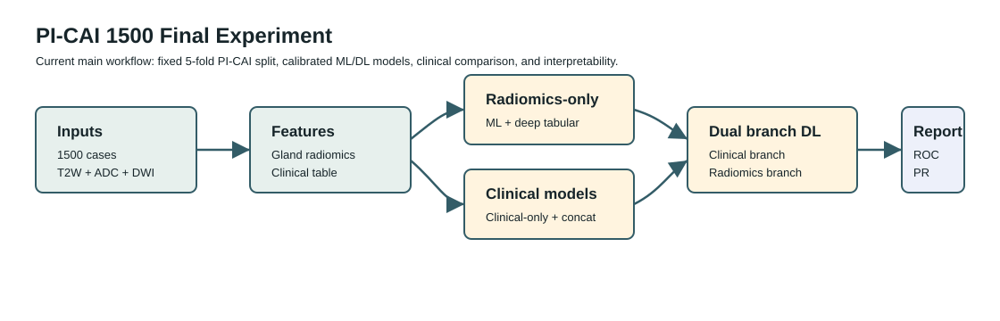

# Prostate Radiomics ML

Final PI-CAI 1500 radiomics workflow for classifying clinically significant
prostate cancer (`csPCa`, `ISUP >= 2`) from multiparametric prostate MRI
radiomics features, clinical variables, and combined tabular models.



The repository is now centered on the latest `picai1500_corr` experiment. Older
experiment configs and SLURM scripts were moved to `archive/` so the default
tree only exposes the current pipeline.

## Quick Start

```bash
python -m venv .venv
source .venv/bin/activate
pip install -e ".[extraction,interpretability,dev]"
```

For deep tabular models:

```bash
pip install -e ".[deep]"
```

## Current Main Workflow

On SLURM, submit the complete PI-CAI 1500 workflow:

```bash
./run.sh
```

This submits dependent jobs for:

1. Radiomics-only calibrated ML.
2. Radiomics-only deep tabular models and threshold postprocessing.
3. Clinical feature preparation.
4. Clinical-only and radiomics+clinical ML.
5. Clinical-only, concatenated, and dual-branch deep models.
6. Final reports, interpretability, and publication tables.

To inspect the job order without submitting:

```bash
./run.sh list
```

The core configs live in:

- `configs/experiments/picai1500_corr/`
- `configs/reports/picai1500_corr/`
- `scripts/hpc/10_picai1500_*.sh` through `18_picai1500_*.sh`

Generated outputs are written to `results/radiomics/picai1500_corr/` and are
ignored by Git.

## Useful CLI Commands

```bash
prostate-radiomics build-features \
  --radiomics-root artifacts/radiomics \
  --mode gland \
  --keep-shape-from t2 \
  --output artifacts/radiomics/concatenated_data/features_all_gland.csv

prostate-radiomics train-classical \
  --config configs/experiments/picai1500_corr/classical_radiomics_only_ml.yaml

prostate-radiomics train-deep \
  --config configs/experiments/picai1500_corr/deep_radiomics_only.yaml

prostate-radiomics compare \
  --config configs/reports/picai1500_corr/clinical_comparison_thresholded.yaml
```

Use `--dry-run` with `extract`, `train-classical`, `train-deep`, and
`interpret` to print the resolved legacy command without launching the job.

## Repository Layout

```text
configs/                  Current PI-CAI 1500 experiment and report configs
scripts/hpc/              Current SLURM jobs for the PI-CAI 1500 workflow
src/prostate_radiomics/   Importable package and unified CLI
tests/                    Unit and smoke tests with synthetic data
train/radiomics/          Historical implementation used by the CLI wrappers
artifacts/                Cohort manifest, source feature tables, model ranking seed
docs/                     Workflow, metrics, outputs, and HPC notes
archive/                  Older configs/scripts kept out of the active workflow
results/                  Generated experiment outputs, ignored by Git
```

## Default Clinical Metrics

The reduced report prioritizes AUROC, AUPRC, sensitivity, specificity, balanced
accuracy, and Brier score. Secondary metrics such as F1, MCC, accuracy, PPV, and
NPV are still computed but are not the default basis for model comparison.

See `docs/workflow.md`, `docs/experiments.md`, `docs/clinical_features.md`,
`docs/interpretability.md`, `docs/metrics.md`, `docs/outputs.md`, and
`docs/hpc.md` for implementation details.
